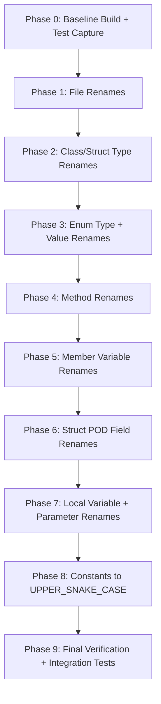
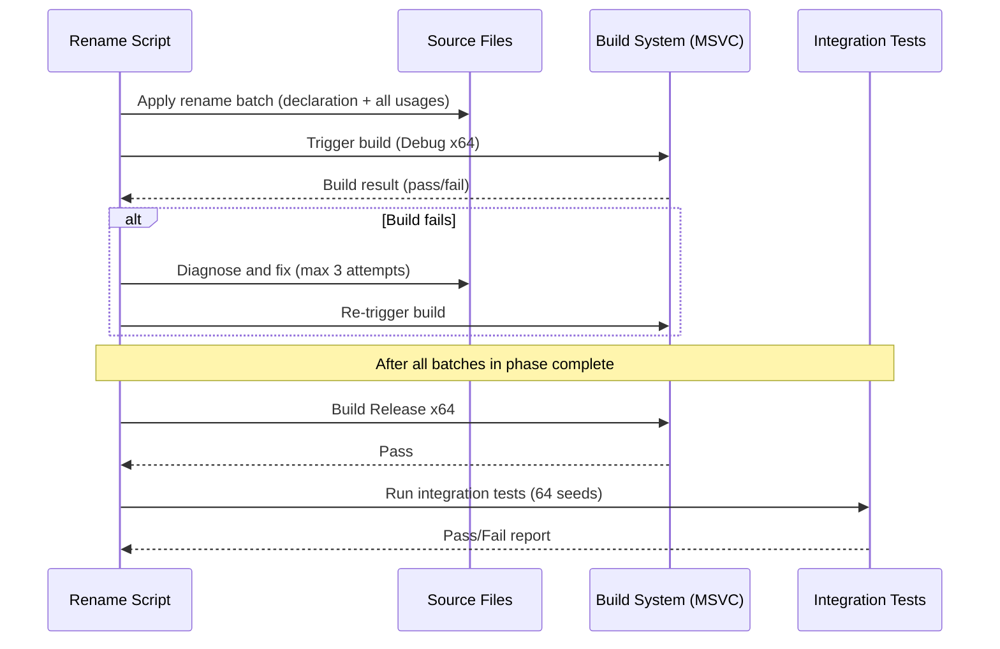
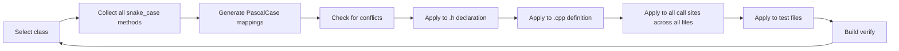

# Design Document: TerrorForm Code Style Refactor

## Overview

This design covers a comprehensive, behavior-preserving rename refactoring of the TerrorForm C++ codebase (~120 non-vendor files, 260+ methods, hundreds of fields). The refactoring brings all identifiers into compliance with the workspace code-style.md naming conventions: PascalCase for classes/methods, camelCase for locals/parameters/POD fields, m_camelCase for member variables, and UPPER_SNAKE_CASE for constants.

The core challenge is performing thousands of textual renames across a tightly-coupled C++ codebase without breaking compilation or altering runtime behavior. The strategy uses a phased, category-ordered approach with build verification gates after each batch, ensuring that any rename error is caught immediately and scoped to a small, reversible change set.

The refactoring operates entirely at the source-text level (no AST-based tooling available in headless mode), using regex-based find-and-replace with careful ordering to avoid partial matches and false positives.

## Architecture

The refactoring is structured as a multi-phase pipeline where each phase targets a single identifier category and produces a compilable intermediate state.



Each phase follows the same internal workflow:



## Components and Interfaces

### Component 1: Rename Mapping Generator

**Purpose**: Produces the exhaustive list of (old_name → new_name) pairs for each identifier category, applying the conversion rules from code-style.md.

```cpp
struct RenameEntry {
    std::string oldName;       // e.g. "is_launch_eligible"
    std::string newName;       // e.g. "IsLaunchEligible"
    std::string category;      // "method", "field", "member", "local", "class", "enum", "file"
    std::string scopeHint;     // Class or file scope for disambiguation
};

// Conversion functions
std::string SnakeToPascal(const std::string& snake);  // is_launch_eligible → IsLaunchEligible
std::string SnakeToCamel(const std::string& snake);   // current_segment → currentSegment
std::string SnakeToMCamel(const std::string& snake);  // m_anim_state → m_animState
```

**Responsibilities**:
- Parse all source files to collect identifiers by category
- Apply naming conversion rules
- Detect naming conflicts (target name already exists in same scope)
- Report conflicts and skip affected entries per Requirement 1.6, 2.3, 3.4, 4.5, 5.4, 6.4

### Component 2: Batch Rename Executor

**Purpose**: Applies a set of RenameEntry operations across all source files atomically within a logical batch.

**Interface**:
```cpp
struct BatchResult {
    int appliedCount;
    int skippedConflicts;
    std::vector<std::string> errors;
};

BatchResult ApplyRenameBatch(
    const std::vector<RenameEntry>& entries,
    const std::vector<std::string>& sourceFiles,
    const RenameOptions& options
);
```

**Responsibilities**:
- Sort renames by length (longest first) to prevent substring collisions
- Apply whole-word regex replacements across all files
- Skip string literals, JSON keys, and preprocessor-stringified values
- Update comments that reference renamed identifiers (Requirement 1.4)
- Handle cross-file atomicity (header + all consuming .cpp files in same batch)

### Component 3: Build Verifier

**Purpose**: Compiles the solution after each batch and reports success/failure.

**Interface**:
```cpp
struct BuildResult {
    bool success;
    int errorCount;
    int warningDelta;  // New warnings minus baseline warnings
    std::vector<CompileError> errors;
};

BuildResult VerifyBuild(Configuration config, Platform platform);
```

**Responsibilities**:
- Invoke MSBuild for Debug|x64 after each batch
- Invoke MSBuild for Release|x64 after each phase
- Compare warning count against pre-phase baseline
- Parse error output for unresolved symbols to guide fix-up

### Component 4: Integration Test Runner

**Purpose**: Executes the 64-seed integration test suite and compares output against the pre-refactor baseline.

**Interface**:
```cpp
struct TestResult {
    bool allPassed;
    int passCount;
    int failCount;
    std::string reportPath;    // Generated Markdown report
    std::string gifPath;       // Animated GIF from first seed
};

TestResult RunIntegrationTests(int seedCount, const std::string& baselinePath);
```

**Responsibilities**:
- Run SDL_VisualTest with 64 deterministic seeds
- Capture stdout/stderr per run
- Compare byte-for-byte against baseline captures
- Generate Markdown report with screenshots
- Record animated GIF from first seed run

## Data Models

### Rename Category Priority Order

The order in which categories are renamed is critical. Types must be renamed before they appear in method signatures, and methods before they appear as member accesses in local code.

| Priority | Category | Convention | Example |
|----------|----------|-----------|---------|
| 1 | File names | PascalCase | `UI_System.h` → `UISystem.h` |
| 2 | Classes/Structs | PascalCase | `Launch_System` → `LaunchSystem` |
| 3 | Enum types | PascalCase | (if any violate) |
| 4 | Enum values | PascalCase | (if any violate) |
| 5 | Methods (public + private) | PascalCase | `is_launch_eligible` → `IsLaunchEligible` |
| 6 | Member variables | m_camelCase | `m_anim_state` → `m_animState` |
| 7 | Struct POD fields | camelCase | `current_segment` → `currentSegment` |
| 8 | Local variables + params | camelCase | `config_filename` → `configFilename` |
| 9 | Constants/defines (if needed) | UPPER_SNAKE_CASE | Already compliant (skip) |

### Exclusion Rules

```cpp
struct ExclusionRules {
    // Never rename content inside these contexts:
    bool insideStringLiteral;       // "playstyle_thresholds" JSON key
    bool insidePreprocessorString;  // #define STRINGIFY(x) #x
    bool insideVendorDirectory;     // vendor/, third-party/
    bool isUpperSnakeCase;          // Already-compliant constants
    bool isSDLOrExternalAPI;        // SDL_Renderer, IMG_Load, etc.
};
```

**Validation Rules**:
- An identifier is a rename candidate only if it belongs to the TerrorForm project (not vendor/external)
- An identifier is excluded if it matches external API patterns (SDL_, IMG_, etc.)
- String literals are never modified regardless of content
- Preprocessor `#define` names in UPPER_SNAKE_CASE are preserved as-is

### Conflict Detection Model

```cpp
struct ConflictReport {
    std::string originalName;
    std::string targetName;
    std::string conflictingIdentifier;  // What already has this name
    std::string filePath;
    int lineNumber;
    std::string resolution;  // "skip" or "manual_review"
};
```

## Phased Execution Plan

### Phase 0: Baseline Capture

1. Build the project in both Debug|x64 and Release|x64 — record warning counts
2. Run the 64-seed integration test suite — capture stdout/stderr as baseline
3. Record the GIF from seed 1 as the pre-refactor visual baseline
4. Commit the baseline state (no changes) as a reference point

### Phase 1: File Renames

**Scope**: Rename `UI_System.h` → `UISystem.h` and `UI_System.cpp` → `UISystem.cpp`

**Steps**:
1. Rename physical files on disk
2. Update all `#include "UI_System.h"` → `#include "UISystem.h"` across all files
3. Update `.vcxproj` and `.vcxproj.filters` to reference new file names
4. Build verify (Debug|x64)

**Risk**: Minimal — only 2 files affected, very low collision risk.

### Phase 2: Class/Struct Type Renames

**Scope**: ~7 types with underscores

| Old Name | New Name |
|----------|----------|
| `Launch_System` | `LaunchSystem` |
| `World_Manager` | `WorldManager` |
| `Exe_Writer` | `ExeWriter` |
| `AI_Title_Service` | `AITitleService` |
| `Playstyle_Term_Threshold` | `PlaystyleTermThreshold` |
| `Gameplay_Stats` | `GameplayStats` |
| `UI_System` | `UISystem` |

**Steps**:
1. For each type: rename in header declaration, forward declarations, all usages (member types, parameter types, template args, friend declarations)
2. Rename in order of dependency (leaf types first, composite types last)
3. Build verify after each type rename

**Risk**: Medium — types appear in many signatures. Forward declarations across files must all be updated atomically.

### Phase 3: Enum Type and Value Renames

**Scope**: Audit all enums. Most are already PascalCase (PostLaunchPhase, MorphPhase). Only rename violations.

**Steps**:
1. Scan all enum declarations for snake_case or UPPER_SNAKE_CASE values
2. Skip any that are already PascalCase-compliant
3. Skip `#define` constants (Requirement 6.5)
4. Rename violations in declaration and all switch/case/comparison sites
5. Build verify

**Risk**: Low — most enums are already compliant per project context.

### Phase 4: Method Renames (Largest Phase)

**Scope**: 260+ methods across 70+ files

**Batching Strategy**: Process one class at a time to keep changes scoped.



**Ordering within a class**:
1. Longest method names first (prevents `update` matching inside `update_animation`)
2. Private methods before public (fewer external references, easier to verify)

**Steps per class**:
1. Rename all methods in the header (declarations)
2. Rename all methods in the .cpp (definitions)
3. Grep all other files for call sites and update
4. Update test files that call these methods
5. Build verify (Debug|x64)

**After all classes done**: Build Release|x64, run integration tests.

### Phase 5: Member Variable Renames

**Scope**: Convert `m_anim_state` → `m_animState`, `m_screen_height` → `m_screenHeight`, etc.

**Steps per class**:
1. Identify all `m_snake_case` members in the class header
2. Convert to `m_camelCase`
3. Update all usages in the .cpp (member access, constructor initializer lists)
4. Build verify

**Risk**: Low — `m_` prefix ensures these don't collide with local variables.

### Phase 6: Struct POD Field Renames

**Scope**: All public fields in POD structs (ProgressBarState, MorphAnimationState, PlaystyleTermThreshold, GameplayStats, etc.)

**Steps per struct**:
1. Rename field declarations in the struct definition
2. Update all member access expressions (`.field_name` and `->field_name`)
3. Update designated initializers if used
4. Update aggregate initialization if used
5. Build verify

**Critical Exclusion**: JSON keys that happen to match field names (e.g., `"term"`, `"metric"`, `"threshold"` in JSON parsing code) must NOT be renamed. Only the C++ identifier is renamed, not the string used to look up the JSON key.

### Phase 7: Local Variables and Parameters

**Scope**: All snake_case locals and params across all function bodies.

**Batching**: Process file-by-file. Local/param renames are scoped to a single function, making them the safest category.

**Steps per file**:
1. Identify all snake_case locals and parameters
2. Convert to camelCase
3. Verify no shadowing conflicts with renamed members/types
4. Build verify (can batch multiple files per build check since scope is local)

**Risk**: Lowest of all phases — scope is entirely local to each function.

### Phase 8: Constants Audit

**Scope**: Verify all `#define` and `constexpr` constants use UPPER_SNAKE_CASE. Based on the codebase inspection, most already do (DISSOLVE_DURATION, MAX_LOD_LEVEL, etc.).

**Steps**:
1. Scan for any constants NOT in UPPER_SNAKE_CASE
2. If found, rename to UPPER_SNAKE_CASE at definition and all usage sites
3. Build verify

**Risk**: Very low — constants are already compliant.

### Phase 9: Final Verification

1. Clean rebuild (both Debug and Release, x64)
2. Run full 64-seed integration test suite
3. Compare output byte-for-byte against Phase 0 baseline
4. Generate Markdown report with screenshots
5. Record animated GIF from seed 1
6. Compare GIF visually against Phase 0 GIF

## Error Handling

### Error Scenario 1: Substring Collision During Rename

**Condition**: Renaming `update` would also affect `update_animation` if not handled as whole-word match.
**Response**: All regex replacements use word-boundary matching (`\b` anchors). Additionally, renames are applied longest-first within each batch.
**Recovery**: If a false positive is detected at build time, revert the last batch and add the problematic identifier to a manual-review list.

### Error Scenario 2: Name Conflict with Existing Identifier

**Condition**: `is_valid` → `IsValid` but `IsValid` already exists as an inherited method from a base class.
**Response**: The conflict detection pass (run before any rename application) identifies these. Conflicting renames are skipped and reported per Requirements 1.6, 2.3, 3.4, 4.5, 5.4, 6.4.
**Recovery**: Skipped identifiers are logged for manual human review post-refactor.

### Error Scenario 3: Build Failure After Rename Batch

**Condition**: A rename missed a reference (e.g., in a macro expansion or template instantiation).
**Response**: Parse the MSVC error output for "undeclared identifier" or "unresolved external symbol" — the old name will appear in the error. Apply the fix (rename the missed reference). Retry up to 3 times per error per Requirement 7.3.
**Recovery**: If 3 attempts fail, halt the phase, revert the batch, log the issue, and report per Requirement 7.4.

### Error Scenario 4: Integration Test Output Mismatch

**Condition**: Post-refactor test output differs from baseline (indicates runtime behavior change).
**Response**: This should never happen if only identifiers are renamed. If it occurs, it means a string literal or serialized value was accidentally modified.
**Recovery**: Diff the outputs to find the divergence. Search for the differing string in the source. Revert the responsible rename. This is a critical bug — halt all further work until resolved.

### Error Scenario 5: Accidental Rename of JSON Key or External API

**Condition**: A JSON field key like `"tiles_cleared_per_minute"` is renamed, or an SDL function like `SDL_CreateWindow` is modified.
**Response**: The exclusion rules filter prevents this. String literals are never touched. External API identifiers (matching `SDL_*`, `IMG_*`, `picojson::*`) are excluded from rename candidates.
**Recovery**: If caught at test time (test output diverges), locate the modified string and revert.

## Testing Strategy

### Build Verification (Every Batch)

- Debug|x64 after every rename batch (single class or single file)
- Release|x64 after every phase completion
- Zero new warnings tolerance (Requirement 7.2)

### Integration Testing (Phase Boundaries)

- 64-seed deterministic test runs
- Byte-identical stdout/stderr comparison against baseline
- Screenshots captured per run for visual diff
- Animated GIF for visual regression confirmation

### Incremental Confidence Model

| After Phase | Verification Level |
|-------------|-------------------|
| Phase 1 (Files) | Build only |
| Phase 2 (Classes) | Build + quick smoke test (1 seed) |
| Phase 4 (Methods) | Build + full 64-seed suite |
| Phase 7 (Locals) | Build + full 64-seed suite |
| Phase 9 (Final) | Build + full 64-seed suite + GIF comparison |

## Performance Considerations

- The refactoring itself has no runtime performance impact (identifier renames only)
- Build time may increase temporarily if intermediate states have many changed files (MSVC incremental build may fall back to full rebuild)
- Integration test suite (64 seeds) takes approximately 5-10 minutes per full run
- Total refactoring time estimate: 4-8 hours of automated processing across all phases

## Security Considerations

- No security impact — pure rename refactoring with no logic changes
- String literals containing potential secrets (API keys, file paths) are explicitly excluded from any modification

## Dependencies

- **MSVC Build Tools**: For compilation verification after each batch
- **SDL_VisualTest**: For integration test execution and visual verification
- **TerrorForm.sln / .vcxproj**: Must be updated for file renames (Phase 1)
- **Git**: For version control of each phase (commit after each successful phase for rollback safety)
