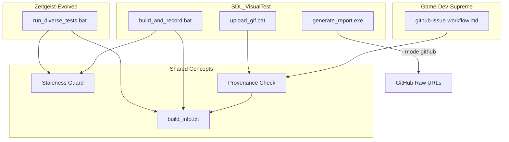
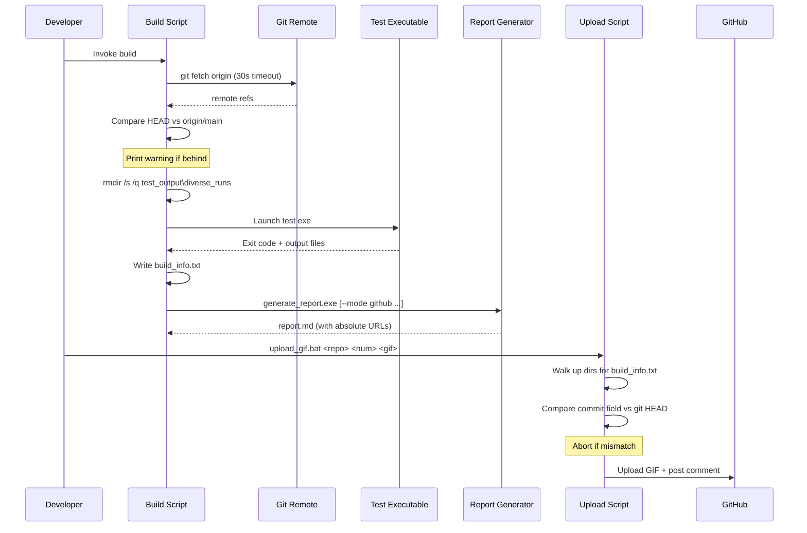

# Design Document: Visual Test Reliability

## Overview

This design hardens the visual test infrastructure across three repositories to eliminate systemic reliability issues. The changes introduce:

1. **Staleness guards** in build scripts that detect when local code is behind remote main
2. **Automatic output cleanup** that removes stale test artifacts before each run
3. **Build provenance files** (`build_info.txt`) that record what code produced each test output
4. **GitHub-compatible report mode** (`--mode github`) in the report generator
5. **Provenance verification** in the upload script and steering doc
6. **Generic level gameplay flows** that replace bespoke per-level test functions with seed-driven generic interaction

All changes are backward-compatible — existing behavior is preserved when new flags are not used.

### Repositories Affected

| Repository | Files Modified | Purpose |
|---|---|---|
| Zeitgeist-Evolved | `scripts/run_diverse_tests.bat`, `tests/test_integration_diverse.cpp` | Staleness guard, cleanup, build_info.txt, generic gameplay flows |
| SDL_VisualTest | `tools/generate_report.cpp`, `tools/build_and_record.bat`, `tools/upload_gif.bat` | GitHub report mode, staleness guard, provenance check |
| Game-Dev-Supreme | `.kiro/steering/github-issue-workflow.md` | Provenance verification instructions |

## Architecture

### High-Level Component Diagram



### Data Flow



## Components and Interfaces

### 1. Staleness Guard (Batch Script Function)

**Location:** Embedded in `run_diverse_tests.bat` and `build_and_record.bat`

**Interface:**
```
Input:  Working directory (must be a git repository)
Output: Warning message to stdout (non-blocking)
Exit:   Always 0 (never fails the build)
```

**Mechanism:**
- Runs `git fetch origin` with a 30-second timeout
- Executes `git rev-list --count HEAD..origin/main` to count commits behind
- Prints warning if count > 0, success message if count == 0
- On any failure (network, auth, timeout): prints skip warning, continues

### 2. Test Output Cleanup (Batch Script Function)

**Location:** `run_diverse_tests.bat` (before test exe launch)

**Interface:**
```
Input:  Target output directory path
Output: Log message confirming cleanup
Exit:   Non-zero if locked files prevent deletion
```

**Mechanism:**
- Uses `rmdir /s /q <path>` on the test_output\diverse_runs directory
- Creates fresh empty directory with `mkdir`
- Fails hard (exit /b 1) if rmdir fails due to locked files

### 3. Build Info File Writer (Batch Script Function)

**Location:** `run_diverse_tests.bat` and `build_and_record.bat` (after test exe completes)

**Interface:**
```
Input:  Git state, run parameters (seed, runs, flow)
Output: build_info.txt in key=value format
Exit:   Non-zero if file cannot be written
```

**File Format:**
```
branch=feature/my-branch
commit=a1b2c3d
timestamp=2025-01-15T14:30:00Z
seed=1
runs=128
flow=campaign
```

### 4. Report Generator GitHub Mode (C++ Enhancement)

**Location:** `tools/generate_report.cpp`

**New CLI Interface:**
```
generate_report.exe <input_dir> <output_file> [--mode github --repo <owner/repo> --branch <branch> --root <relative_path>]
```

**Behavior:**
- Without `--mode`: relative paths (existing behavior unchanged)
- With `--mode github`: absolute URLs using `raw.githubusercontent.com` for images and `github.com/blob/` for links
- Missing required args with `--mode github`: exit code 1 with stderr message
- Percent-encodes non-URI-safe characters per RFC 3986

### 5. Upload Script Provenance Check (Batch Script Enhancement)

**Location:** `tools/upload_gif.bat`

**New Behavior (inserted before existing upload logic):**
1. Starts at GIF file's parent directory
2. Walks up directory tree looking for `build_info.txt`
3. If found: extracts `commit` field, validates hex format (7 or 40 chars)
4. Compares against `git rev-parse HEAD` (short or full depending on manifest length)
5. Mismatch → abort with error, exit code 1
6. Not found → print warning, proceed (backward compatibility)
7. Malformed → abort with error, exit code 1

### 6. Steering Doc Provenance Section (Markdown Addition)

**Location:** `Game-Dev-Supreme/.kiro/steering/github-issue-workflow.md`

**New Section:** Added under "Visual Testing (SDL Projects)" to instruct Kiro to:
1. Read `build_info.txt` before uploading GIFs
2. Compare `commit` field against current HEAD (full 40-char SHA)
3. Abort if mismatch or file missing/malformed
4. Warn if timestamp > 60 minutes old

### 7. Generic Level Gameplay Flow (C++ Refactor)

**Location:** `Zeitgeist-Evolved/tests/test_integration_diverse.cpp`

**Problem:** The existing approach requires writing a custom `BuildFlow<LevelName>()` function with hardcoded grid coordinates for each specific level. This doesn't scale and produces brittle tests.

**Solution:** Replace bespoke per-level flow functions with a generic gameplay interaction pattern that uses only relative UI navigation:

**Mechanism:**
1. Navigate to the desired campaign category using the existing folder selection logic (seed-driven)
2. Select a level by navigating down N steps (seed-driven)
3. **Generic gadget placement phase:**
   - Tab to the tile/item panel
   - Navigate down by `seed % item_count` steps to select a gadget
   - Tab back to the grid
   - Move cursor using WASD by `seed`-derived offsets
   - Press Enter/Space to place
   - Repeat `2 + seed % 3` times (place 2-4 gadgets)
   - Rotate last-placed gadget `seed % 4` times using R key
4. Start simulation with P key
5. Wait 600+ frames for outcome
6. Capture screenshots at key checkpoints throughout

**Named flow aliases (e.g., `--flow challenge3`):** Instead of a dedicated function, map the name to a campaign category + level index:
- `challenge3` → category=Challenges (folder index 2), level index=2 (0-based)
- `tutorial5` → category=Tutorials (folder index 1), level index=4
- The mapping table replaces the `g_namedFlows[]` entries for per-level flows

**What gets removed:**
- `BuildFlowChallenge3()` function
- Any future bespoke per-level flow functions
- The `{"challenge3", BuildFlowChallenge3}` and `{"challenge-3", BuildFlowChallenge3}` entries in `g_namedFlows[]`

**What gets added:**
- A `BuildGenericGameplayFlow(int seed, int folder_index, int level_index)` function
- Named flow aliases that call `BuildGenericGameplayFlow` with pre-set folder/level indices

## Data Models

### build_info.txt Schema

| Field | Type | Format | Required | Example |
|---|---|---|---|---|
| `branch` | string | Git branch name or "unknown" | Yes | `feature/stop-button` |
| `commit` | string | 7-char short SHA or "unknown" | Yes | `a1b2c3d` |
| `timestamp` | string | ISO 8601 UTC with seconds | Yes | `2025-01-15T14:30:00Z` |
| `seed` | integer | Positive integer | Yes | `1` |
| `runs` | integer | Positive integer | Yes | `128` |
| `flow` | string | Flow name or "all" | Yes | `campaign` |

**Extended fields** (only in `build_and_record.bat` output):

| Field | Type | Format | Required | Example |
|---|---|---|---|---|
| `sdl_visualtest_commit` | string | 7-char short SHA | Yes | `b2c3d4e` |
| `target_staleness` | string | "up-to-date" or "N commits behind" | Yes | `3 commits behind` |
| `sdl_visualtest_staleness` | string | "up-to-date" or "N commits behind" | Yes | `up-to-date` |

**Parsing rules:**
- One field per line
- Format: `key=value` (no spaces around `=`)
- Lines not matching `key=value` pattern are ignored
- Keys are case-sensitive
- Values may contain any characters except newline

### Report Generator URL Templates

**Image URL (GitHub mode):**
```
https://raw.githubusercontent.com/<owner>/<repo>/<branch>/<root>/<image_path>
```

**Link URL (GitHub mode):**
```
https://github.com/<owner>/<repo>/blob/<branch>/<root>/<report_path>
```

**Percent-encoding:** Characters outside `A-Za-z0-9-_.~` in path segments are encoded as `%XX`.


## Correctness Properties

*A property is a characteristic or behavior that should hold true across all valid executions of a system — essentially, a formal statement about what the system should do. Properties serve as the bridge between human-readable specifications and machine-verifiable correctness guarantees.*

### Property 1: Staleness warning includes correct commit count

*For any* positive integer N representing commits behind remote, the staleness guard output SHALL contain the exact integer N in its warning message and the text "behind" (regardless of which script — `run_diverse_tests.bat` or `build_and_record.bat` — produces it).

**Validates: Requirements 1.2, 6.3, 6.4**

### Property 2: build_info.txt round-trip preserves all fields

*For any* valid combination of branch name, 7-character hex commit hash, ISO 8601 timestamp, positive seed integer, positive runs integer, and flow name string, writing a build_info.txt and then parsing it back SHALL produce the same values for all fields, with each field on its own line in `key=value` format.

**Validates: Requirements 3.2, 3.3, 3.4, 6.5**

### Property 3: GitHub mode produces correct absolute URLs for images

*For any* valid owner/repo string, branch name, root path, and image filename, when the report generator operates in `--mode github`, all image references in the output SHALL be absolute URLs starting with `https://raw.githubusercontent.com/<owner>/<repo>/<branch>/<root>/` followed by the image path.

**Validates: Requirements 4.1, 4.2**

### Property 4: Default mode produces only relative paths

*For any* report generated without the `--mode` flag, all image references and inter-report links in the output SHALL be relative paths (containing no `https://` prefix).

**Validates: Requirements 4.3**

### Property 5: Percent-encoding of non-URI-safe characters

*For any* path string containing characters outside the unreserved URI character set (`A-Za-z0-9-_.~`), the report generator in GitHub mode SHALL produce a URL where those characters are percent-encoded as `%XX` per RFC 3986, and decoding the encoded URL SHALL recover the original path.

**Validates: Requirements 4.5**

### Property 6: Directory traversal finds nearest ancestor build_info.txt

*For any* directory tree of depth 1–10 where a `build_info.txt` file exists at level K from the starting directory, the upload script's traversal SHALL find it in exactly K iterations (walking up K parent directories), and SHALL not continue past it to find a different `build_info.txt` higher in the tree.

**Validates: Requirements 7.1**

### Property 7: Commit hash validation and comparison

*For any* string, the upload script's commit validation SHALL accept it if and only if it is a hexadecimal string of exactly 7 or exactly 40 characters. When valid, comparison against HEAD SHALL use the first 7 characters of HEAD for 7-char hashes and the full 40 characters for 40-char hashes, correctly detecting match vs. mismatch.

**Validates: Requirements 7.2, 7.3**

## Error Handling

### Staleness Guard Errors

| Scenario | Behavior | Exit Code |
|---|---|---|
| `git fetch origin` times out (>30s) | Print "WARNING: Could not reach remote — staleness check skipped" | 0 |
| `git fetch origin` fails (network/auth) | Print "WARNING: Could not reach remote — staleness check skipped" | 0 |
| `git rev-list` fails | Print warning, skip staleness check | 0 |
| Remote ahead of local | Print warning with count, continue | 0 |

**Design rationale:** The staleness guard is advisory only. Build failures should never be caused by network issues or temporary git problems. The developer sees the warning and can decide to pull.

### Cleanup Errors

| Scenario | Behavior | Exit Code |
|---|---|---|
| Directory doesn't exist | Create it, proceed | 0 |
| Locked file prevents deletion | Print error with path | Non-zero |
| Permissions issue | Print error with path | Non-zero |

**Design rationale:** A locked file means another process is using the test output (e.g., a report viewer). This is a genuine blocker — the test would produce unreliable results mixing old and new output.

### build_info.txt Write Errors

| Scenario | Behavior | Exit Code |
|---|---|---|
| Output directory doesn't exist | Error (should not happen — cleanup creates it) | Non-zero |
| Write permission denied | Print error with file path | Non-zero |
| Git not available | Write `branch=unknown`, `commit=unknown` | 0 |

### Report Generator Errors

| Scenario | Behavior | Exit Code |
|---|---|---|
| `--mode github` without `--repo` | stderr: "Error: --mode github requires --repo argument" | 1 |
| `--mode github` without `--branch` | stderr: "Error: --mode github requires --branch argument" | 1 |
| `--mode github` without `--root` | stderr: "Error: --mode github requires --root argument" | 1 |
| Input directory doesn't exist | stderr: "Error: Input directory does not exist" | 1 |

### Upload Script Provenance Errors

| Scenario | Behavior | Exit Code |
|---|---|---|
| build_info.txt not found (traversed to root) | Print warning, proceed with upload | 0 |
| build_info.txt found but no `commit` field | Print "manifest is malformed" error | 1 |
| `commit` field not valid hex (7 or 40 chars) | Print "manifest is malformed" error | 1 |
| Commit mismatch | Print error with recorded vs actual | 1 |
| `git rev-parse HEAD` fails | Print error (cannot determine HEAD) | 1 |

**Design rationale:** The upload script's backward compatibility (no build_info.txt → warning + proceed) ensures existing workflows that predate this feature continue working. Once provenance files are consistently generated, the warning signals a problem without breaking older setups.

## Testing Strategy

### Unit Tests (Example-Based)

| Test | Component | Validates |
|---|---|---|
| Staleness guard: up-to-date (count=0) | Batch logic | Req 1.4 |
| Staleness guard: fetch failure | Batch logic | Req 1.5 |
| Cleanup: dir doesn't exist | Batch logic | Req 2.2 |
| Cleanup: success log message | Batch logic | Req 2.3 |
| Cleanup: locked file failure | Batch logic | Req 2.4 |
| build_info.txt: git unavailable | Batch logic | Req 3.5 |
| Report: missing --repo arg | generate_report.cpp | Req 4.4 |
| Report: missing --branch arg | generate_report.cpp | Req 4.4 |
| Report: missing --root arg | generate_report.cpp | Req 4.4 |
| Upload: no build_info.txt → warning + proceed | upload_gif.bat | Req 7.7 |
| Upload: commit mismatch → abort | upload_gif.bat | Req 7.4 |
| Upload: git rev-parse fails | upload_gif.bat | Req 7.6 |

### Property-Based Tests

Property-based tests use randomized inputs to verify universal properties across many scenarios. Each test runs a minimum of 100 iterations.

**Library:** [fast-check](https://github.com/dubzzz/fast-check) (TypeScript) for the pure logic functions extracted from the batch scripts and C++ code.

| Property Test | Validates | Min Iterations |
|---|---|---|
| Staleness count in warning message | Property 1 (Req 1.2, 6.3, 6.4) | 100 |
| build_info.txt write/parse round-trip | Property 2 (Req 3.2, 3.3, 3.4, 6.5) | 100 |
| GitHub mode URL format | Property 3 (Req 4.1, 4.2) | 100 |
| Default mode relative paths | Property 4 (Req 4.3) | 100 |
| Percent-encoding round-trip | Property 5 (Req 4.5) | 100 |
| Directory traversal correctness | Property 6 (Req 7.1) | 100 |
| Commit validation and comparison | Property 7 (Req 7.2, 7.3) | 100 |

Each property test is tagged with: **Feature: visual-test-reliability, Property N: {property_text}**

### Integration Tests

| Test | Scope | Validates |
|---|---|---|
| Full run_diverse_tests.bat with staleness + cleanup + build_info | End-to-end | Req 1, 2, 3 |
| generate_report.exe --mode github on real test output | End-to-end | Req 4 |
| upload_gif.bat with matching provenance | End-to-end | Req 7 |
| upload_gif.bat with mismatching provenance | End-to-end | Req 7.4 |

### Backward Compatibility Tests

| Test | Verifies |
|---|---|
| `run_diverse_tests.bat` runs without network (offline) | Staleness guard doesn't block |
| `generate_report.exe` without `--mode` flag | Existing relative-path behavior unchanged |
| `upload_gif.bat` on output without build_info.txt | Proceeds with warning (no abort) |

---

## Low-Level Design

### Pseudocode: Staleness Guard (run_diverse_tests.bat)

```batch
:staleness_guard
REM --- Staleness Guard ---
echo === Checking for staleness against remote ===

REM Fetch with timeout (Windows doesn't have native timeout for git,
REM so we use a background job approach or just let it run)
git fetch origin 2>nul
if %errorlevel% neq 0 (
    echo WARNING: Could not reach remote — staleness check skipped
    goto :staleness_done
)

REM Count commits we're behind
for /f %%n in ('git rev-list --count HEAD..origin/main 2^>nul') do set BEHIND_COUNT=%%n
if not defined BEHIND_COUNT (
    echo WARNING: Could not reach remote — staleness check skipped
    goto :staleness_done
)

if %BEHIND_COUNT% gtr 0 (
    echo WARNING: LOCAL BRANCH IS BEHIND REMOTE by %BEHIND_COUNT% commit(s).
    echo Consider running: git pull origin main
) else (
    echo Branch is up to date with remote
)

:staleness_done
```

### Pseudocode: Test Output Cleanup (run_diverse_tests.bat)

```batch
:cleanup_output
set OUTPUT_DIR=test_output\diverse_runs

if exist "%OUTPUT_DIR%" (
    rmdir /s /q "%OUTPUT_DIR%" 2>nul
    if exist "%OUTPUT_DIR%" (
        echo [ERROR] Failed to delete %OUTPUT_DIR% — files may be locked.
        exit /b 1
    )
)

mkdir "%OUTPUT_DIR%"
echo Cleaned test output directory: %OUTPUT_DIR%
```

### Pseudocode: build_info.txt Writer (run_diverse_tests.bat)

```batch
:write_build_info
set BUILD_INFO_PATH=%OUTPUT_DIR%\run_seed%SEED%\build_info.txt

REM Get current timestamp in ISO 8601 UTC
REM (Windows batch workaround — use wmic or powershell)
for /f %%t in ('powershell -command "Get-Date -Format 'yyyy-MM-ddTHH:mm:ssZ' -AsUTC"') do set TIMESTAMP=%%t

REM Get git info (fallback to "unknown")
for /f "tokens=*" %%b in ('git rev-parse --abbrev-ref HEAD 2^>nul') do set GIT_BRANCH=%%b
if not defined GIT_BRANCH set GIT_BRANCH=unknown
for /f "tokens=*" %%c in ('git rev-parse --short HEAD 2^>nul') do set GIT_COMMIT=%%c
if not defined GIT_COMMIT set GIT_COMMIT=unknown

REM Write file
(
    echo branch=%GIT_BRANCH%
    echo commit=%GIT_COMMIT%
    echo timestamp=%TIMESTAMP%
    echo seed=%SEED%
    echo runs=%RUNS%
    echo flow=%FLOW%
) > "%BUILD_INFO_PATH%"

if %errorlevel% neq 0 (
    echo [ERROR] Failed to write build_info.txt to %BUILD_INFO_PATH%
    exit /b 1
)
echo === Build provenance written: %BUILD_INFO_PATH% ===
```

### Pseudocode: Report Generator GitHub Mode (generate_report.cpp)

```cpp
// New struct for GitHub mode configuration
struct GitHubModeConfig {
    bool enabled;
    std::string repo;    // "owner/repo"
    std::string branch;  // "main" or "feature/xyz"
    std::string root;    // "test_output/diverse_runs"
};

// New function: percent-encode a path segment per RFC 3986
static std::string percent_encode(const std::string& input) {
    std::string result;
    for (unsigned char c : input) {
        if (isalnum(c) || c == '-' || c == '_' || c == '.' || c == '~' || c == '/') {
            result += c;
        } else {
            char buf[4];
            snprintf(buf, sizeof(buf), "%%%02X", c);
            result += buf;
        }
    }
    return result;
}

// New function: build an image URL
static std::string make_image_url(const GitHubModeConfig& cfg, const std::string& image_path) {
    if (!cfg.enabled) return image_path;  // relative path
    return "https://raw.githubusercontent.com/" + cfg.repo + "/"
         + cfg.branch + "/" + percent_encode(cfg.root + "/" + image_path);
}

// New function: build a link URL
static std::string make_link_url(const GitHubModeConfig& cfg, const std::string& report_path) {
    if (!cfg.enabled) return report_path;  // relative path
    return "https://github.com/" + cfg.repo + "/blob/"
         + cfg.branch + "/" + percent_encode(cfg.root + "/" + report_path);
}

// Modified main(): parse new CLI arguments
// After existing argument parsing:
GitHubModeConfig github_cfg = {};
for (int i = 3; i < argc; i++) {
    if (strcmp(argv[i], "--mode") == 0 && i + 1 < argc) {
        if (strcmp(argv[i + 1], "github") == 0) github_cfg.enabled = true;
        i++;
    } else if (strcmp(argv[i], "--repo") == 0 && i + 1 < argc) {
        github_cfg.repo = argv[++i];
    } else if (strcmp(argv[i], "--branch") == 0 && i + 1 < argc) {
        github_cfg.branch = argv[++i];
    } else if (strcmp(argv[i], "--root") == 0 && i + 1 < argc) {
        github_cfg.root = argv[++i];
    }
}

// Validate required args for github mode
if (github_cfg.enabled) {
    if (github_cfg.repo.empty()) {
        fprintf(stderr, "Error: --mode github requires --repo argument\n");
        return 1;
    }
    if (github_cfg.branch.empty()) {
        fprintf(stderr, "Error: --mode github requires --branch argument\n");
        return 1;
    }
    if (github_cfg.root.empty()) {
        fprintf(stderr, "Error: --mode github requires --root argument\n");
        return 1;
    }
}
```

### Pseudocode: upload_gif.bat Provenance Check

```batch
:provenance_check
REM Walk up directory tree from GIF's parent to find build_info.txt
set GIF_DIR=%~dp3
set SEARCH_DIR=%GIF_DIR%
set BUILD_INFO_FOUND=

:walk_up_loop
if exist "%SEARCH_DIR%build_info.txt" (
    set BUILD_INFO_FOUND=%SEARCH_DIR%build_info.txt
    goto :check_provenance
)
REM Go up one level
for %%P in ("%SEARCH_DIR%..") do set PARENT_DIR=%%~fP\
if "%PARENT_DIR%"=="%SEARCH_DIR%" goto :no_build_info
set SEARCH_DIR=%PARENT_DIR%
goto :walk_up_loop

:no_build_info
echo WARNING: No build_info.txt found alongside GIF. Cannot verify freshness.
goto :proceed_upload

:check_provenance
REM Extract commit field
set MANIFEST_COMMIT=
for /f "tokens=1,* delims==" %%a in ('findstr /b "commit=" "%BUILD_INFO_FOUND%"') do set MANIFEST_COMMIT=%%b

REM Validate: must be hex, 7 or 40 chars
if not defined MANIFEST_COMMIT (
    echo ERROR: build_info.txt is malformed — missing commit field. Aborting upload.
    exit /b 1
)
REM (Validate hex and length using findstr pattern matching)
echo %MANIFEST_COMMIT%| findstr /r "^[0-9a-fA-F][0-9a-fA-F][0-9a-fA-F][0-9a-fA-F][0-9a-fA-F][0-9a-fA-F][0-9a-fA-F]$" >nul 2>&1
if %errorlevel%==0 goto :commit_valid_short
echo %MANIFEST_COMMIT%| findstr /r "^[0-9a-fA-F]*$" >nul 2>&1
if %errorlevel% neq 0 (
    echo ERROR: build_info.txt commit field is not valid hexadecimal. Aborting upload.
    exit /b 1
)
REM Check length is 40 for full hash
REM (batch length check via variable substitution trick)
goto :commit_valid_full

:commit_valid_short
REM Compare short hash against first 7 chars of HEAD
cd /d "%GIF_DIR%"
for /f %%h in ('git rev-parse --short HEAD 2^>nul') do set CURRENT_SHORT=%%h
if not defined CURRENT_SHORT (
    echo ERROR: Cannot determine current HEAD. Aborting upload.
    exit /b 1
)
if /i not "%MANIFEST_COMMIT%"=="%CURRENT_SHORT%" (
    echo ERROR: GIF was generated from commit %MANIFEST_COMMIT% but current HEAD is %CURRENT_SHORT%. Aborting upload.
    exit /b 1
)
goto :proceed_upload

:commit_valid_full
REM Compare full hash against HEAD
cd /d "%GIF_DIR%"
for /f %%h in ('git rev-parse HEAD 2^>nul') do set CURRENT_FULL=%%h
if not defined CURRENT_FULL (
    echo ERROR: Cannot determine current HEAD. Aborting upload.
    exit /b 1
)
if /i not "%MANIFEST_COMMIT%"=="%CURRENT_FULL%" (
    echo ERROR: GIF was generated from commit %MANIFEST_COMMIT% but current HEAD is %CURRENT_FULL%. Aborting upload.
    exit /b 1
)
goto :proceed_upload

:proceed_upload
REM ... existing upload logic continues ...
```

### Pseudocode: build_and_record.bat Staleness Guard

```batch
:dual_staleness_check
REM Check staleness for target project
cd /d "%PROJECT_PATH%"
git fetch origin 2>nul
if %errorlevel% neq 0 (
    echo WARNING: Could not reach remote for target project — staleness check skipped
    goto :check_sdl_staleness
)
for /f %%n in ('git rev-list --count HEAD..origin/main 2^>nul') do set TARGET_BEHIND=%%n
if defined TARGET_BEHIND if %TARGET_BEHIND% gtr 0 (
    echo WARNING: Target project is behind remote main by %TARGET_BEHIND% commit(s). GIF may reflect stale code.
)

:check_sdl_staleness
REM Check staleness for SDL_VisualTest
cd /d "c:\Users\Daniel Sawitzki\Desktop\github\SDL_VisualTest"
git fetch origin 2>nul
if %errorlevel% neq 0 (
    echo WARNING: Could not reach SDL_VisualTest remote — staleness check skipped
    goto :staleness_complete
)
for /f %%n in ('git rev-list --count HEAD..origin/main 2^>nul') do set SVT_BEHIND=%%n
if defined SVT_BEHIND if %SVT_BEHIND% gtr 0 (
    echo WARNING: SDL_VisualTest is behind remote main by %SVT_BEHIND% commit(s). Test harness may be stale.
)

:staleness_complete
cd /d "%PROJECT_PATH%"
```

